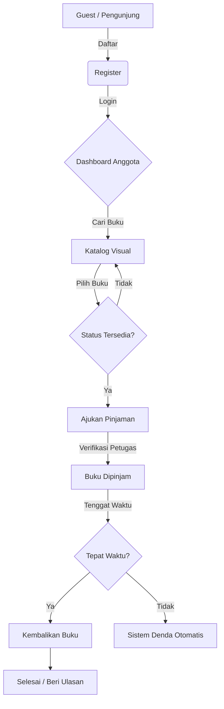

# 📚 MASTER DOCUMENTATION: Cozy-Library Management System
**The Complete Blueprint for a Professional Automated Library**

Dokumen ini adalah sumber kebenaran tunggal untuk seluruh sistem Cozy-Library, mencakup alur kerja, rincian peran pengguna, arsitektur teknis, dan mekanisme otomasi.

---

## 📂 DAFTAR ISI
1. [Overview & Alur Utama](#1-overview--alur-utama)
2. [Rincian Detail Roles (RBAC)](#2-rincian-detail-roles-rbac)
3. [Arsitektur Transaksi & Bisnis](#3-arsitektur-transaksi--bisnis)
4. [Engine Otomasi Email (Cron Jobs)](#4-engine-otomasi-email-cron-jobs)
5. [Integritas Data & Keamanan](#5-integritas-data--keamanan)
6. [Panduan Produksi & Deployment](#6-panduan-produksi--deployment)

---

## 1. OVERVIEW & ALUR UTAMA

Cozy-Library dirancang untuk mendigitalisasi operasional perpustakaan dengan fokus pada pengalaman pengguna (UX) dan efisiensi petugas melalui otomasi.

### Alur Kerja Pengguna (Member Journey)


---

## 2. RINCIAN DETAIL ROLES (RBAC)

Sistem menggunakan *Role-Based Access Control* (RBAC) untuk memastikan keamanan data.

### 🔐 ADMINISTRATOR (The Architect)
- **Kontrol Pengguna**: Manajemen akun Petugas dan Anggota (CRUD, Aktivasi/Deaktivasi).
- **Master Data**: Kendali penuh atas Kategori Buku dan parameter denda global.
- **Konfigurasi**: Pengaturan SMTP Email dan identitas perpustakaan.
- **Laporan**: Akses ke seluruh data sirkulasi untuk audit buku.

### 🛠️ PETUGAS (The Operator)
- **Manajemen Sirkulasi**: Verifikasi permintaan pinjaman dan pemrosesan pengembalian.
- **Manajemen Buku**: Update metadata koleksi dan kontrol stok fisik.
- **Administrasi Denda**: Mengelola status pembayaran denda secara manual jika diperlukan.

### 📖 ANGGOTA (The Reader)
- **E-Catalog**: Mencari buku melalui katalog visual modern berdesain kartu.
- **Self-Service**: Mengajukan pinjaman secara mandiri dan memantau status secara real-time.
- **Engagement**: Memberikan rating & ulasan (ulasan buku memperkaya data katalog).
- **Otomasi**: Menerima notifikasi email profesional untuk pengingat dan penagihan.

---

## 3. ARSITEKTUR TRANSAKSI & BISNIS

### Siklus Hidup Buku
Setiap buku melewati beberapa status dalam database:
1.  **Tersedia**: Siap untuk dipinjam.
2.  **Pending**: Sedang diajukan oleh Anggota (menunggu verifikasi).
3.  **Dipinjam**: Sedang berada di tangan Anggota.
4.  **Dikembalikan**: Transaksi selesai, statistik diperbarui.

### Logika Perhitungan Denda
Denda tidak bersifat statis, melainkan dihitung secara dinamis saat sistem diakses atau saat email dikirim:
- **Rumus**: `(Hari Terlambat * Biaya Denda Per Hari)`
- **Kondisi**: Hanya berlaku jika `status_transaksi = 'Peminjaman'` dan `tgl_kembali_rencana < CURRENT_DATE`.

---

## 4. ENGINE OTOMASI EMAIL (CRON JOBS)

Ini adalah fitur "Smart Library" yang membedakan Cozy-Library dari sistem konvensional.

| Skrip | Jadwal (Rekomendasi) | Fungsi Utama |
| :--- | :--- | :--- |
| `reminder_h1.php` | Setiap Hari (08:00 AM) | Mengirim pengingat ramah ke email anggota 1 hari sebelum jatuh tempo. |
| `overdue_reminder.php` | Setiap Jam / Hari | Mengirim penagihan *Invoice* resmi jika anggota terlambat mengembalikan. |

**Fitur Email:**
- Desain *Professional HTML Invoice*.
- Prioritas tinggi (*X-Priority: 1*) agar tidak masuk folder Spam.
- Link langsung ke dashboard untuk proses tindak lanjut.

---

## 5. INTEGRITAS DATA & KEAMANAN

Untuk menjamin status "Professional Grade", sistem menerapkan:
- **Bcrypt Hashing**: Password disimpan dalam format terenkripsi satu arah.
- **Prepared Statements**: Melindungi setiap query SQL dari ancaman *Injection*.
- **Session Security**: Validasi level akses di setiap halaman untuk mencegah pembobolan URL.
- **Environment Isolation**: Kredensial sensitif disimpan di `.env.local` yang tidak boleh diakses publik.

---

## 6. PANDUAN PRODUKSI & DEPLOYMENT

Langkah cepat untuk memigrasikan sistem ke server online:
1.  **Migrasi File**: Upload semua file ke server via FTP atau Git.
2.  **Database**: Import file SQL dan sesuaikan koneksinya di `config/database.php`.
3.  **Setup Kredensial**: Buat file `.env.local` di server:
    ```ini
    DB_HOST = "localhost"
    DB_USER = "db_user_anda"
    DB_PASS = "password_anda"
    SMTP_HOST = "smtp.gmail.com"
    SMTP_USER = "email_perpustakaan@gmail.com"
    SMTP_PASS = "app_password_google"
    ```
4.  **Aktifkan Cron**: Atur di CPanel atau VPS Crontab agar menjalankan skrip di folder `/cron/`.

---
**Cozy-Library Management System — Built for Excellence.** 🚀
